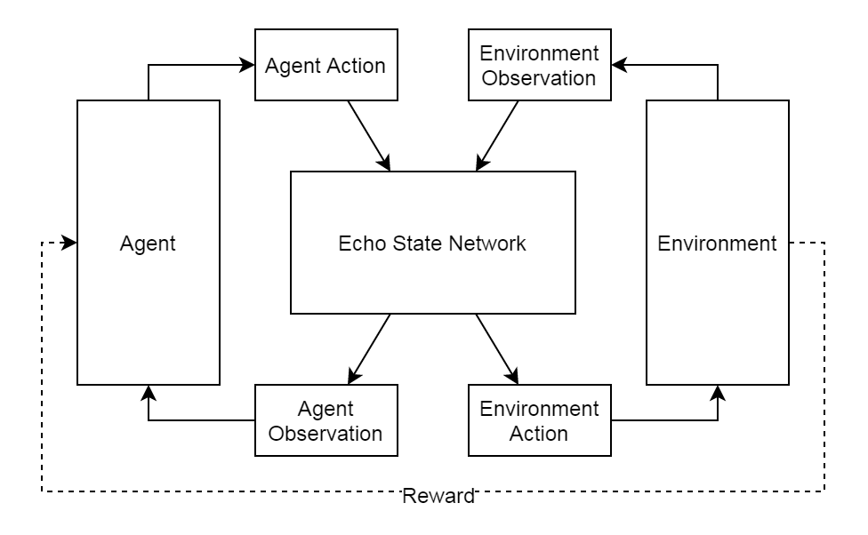

# Echo State Network Wrapper
An observation wrapper for OpenAI Gym environments that uses an
[echo state network](http://www.scholarpedia.org/article/Echo_state_network)
to modify the observation of the wrapped environment.

## TODO
* Add complete ESN wrapper (ESN would have 2 inputs: agent action and environment
  observation, and 2 outputs: agent observation and environment action)

